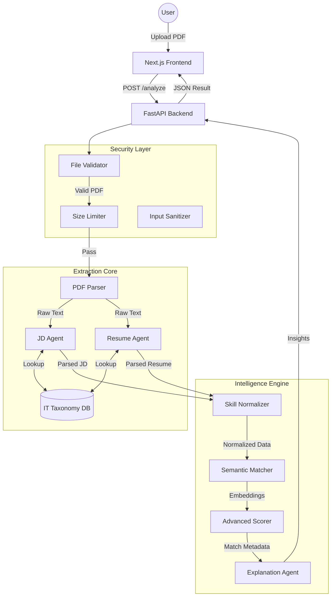

# Matchly AI: Advanced IT Resume Analyzer

<div align="center">
  
  
  
  
</div>

<br />

**Matchly AI** is a next-generation resume parsing and scoring engine specialized for the IT industry. Unlike generic parsers, it understands the nuance of technical stacks, mapping relationships between technologies (e.g., treating `Django` and `FastAPI` as related backend frameworks) and detecting deep security/architectural capabilities.

---

## 🏗️ Architecture & Flow

The system follows a secure, agentic pipeline architecture designed for high precision and data safety.



### System Flow
1.  **Secure Ingestion**: Files are validated for magic numbers (true PDF check) and size constraints (max 5MB) before processing.
2.  **Agentic Extraction**:
    *   **JDAgent**: Analyzes Job Descriptions to detect domain type (DevOps, AI, Web) and required stack.
    *   **ResumeAgent**: Extracts skills with *evidence* context (e.g., finding "Python" within a "Project" section carries more weight than a keyword list).
3.  **Taxonomy Normalization**: Converts aliases (`ReactJS`, `React.js`) to canonical forms (`react`) using a 15-category IT master database.
4.  **Semantic Scoring**: Uses vector embeddings and cluster affinity (e.g., Frontend Frameworks) to score candidates even if exact keywords miss, provided they have relevant adjacent skills.
5.  **Insight Generation**: Produces a detailed gap analysis, match report, and interview questions.

---

## 🛡️ Security Features

This project implements a rigorous set of security controls (100+ checks verified via `test_security.py`):

*   **File Upload Security**:
    *   Strict **Magic Number (Header)** Validation to prevent extension spoofing (e.g., `.exe` renamed to `.pdf`).
    *   **5MB Hard Limit** on uploads to prevent Denial of Service (DoS).
*   **Input Validation**:
    *   Text input length caps (100k chars) to prevent memory exhaustion.
    *   Sanitized error handling to suppress stack traces in production.
*   **Dependency Safety**:
    *   No external shell executions (`subprocess` calls are restricted).
    *   Restricted CORS policy (`localhost` only).
*   **Data Privacy**:
    *   Stateless processing: Files are processed in-memory and not permanently stored.

---

## 🚀 Setup & Installation

### Prerequisites
*   Python 3.9+
*   Node.js 16+
*   npm / yarn

### 1. Backend Setup
```bash
cd backend
python -m venv venv
# Windows
.\venv\Scripts\activate
# Mac/Linux
source venv/bin/activate

pip install -r requirements.txt
python -m spacy download en_core_web_sm
```

### 2. Frontend Setup
```bash
cd frontend
npm install
```

### 3. Running the Application
**Backend** (Terminal 1):
```bash
cd backend
uvicorn main:app --reload --port 8000
```

**Frontend** (Terminal 2):
```bash
cd frontend
npm run dev
```

Visit `http://localhost:3000` to start analyzing.

---

## 🧪 Testing

The project includes two comprehensive test suites:

1.  **Security Tests**: Verifies upload protections and input sanitization.
    ```bash
    pytest backend/tests/test_security.py
    ```

2.  **Logic Tests**: Verifies IT taxonomy extraction and scoring accuracy.
    ```bash
    pytest backend/tests/test_comprehensive_logic.py
    ```

---

## 📊 Feature Highlights

*   **15+ IT Domains**: Specialized parsing for Cloud, DevOps, AI/ML, Security, Mobile, and Web.
*   **Evidence-Based Scoring**: Distinguishes between "claimed" skills and "proven" skills with context.
*   **Gap Analysis**: Identifies exactly what a candidate is missing and suggests projects to fix it.
*   **Visual Dashboard**: Beautiful, responsive UI with real-time feedback.
